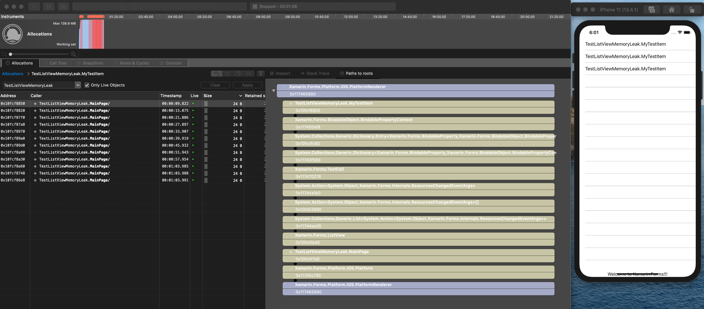
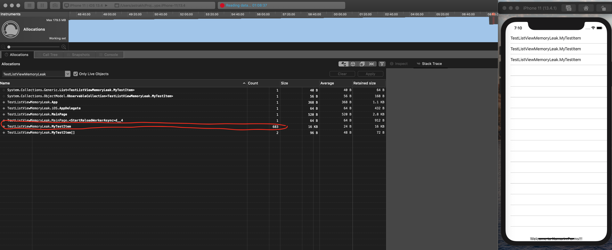

# Xamarin.Forms ListView MemoryLeak Troubleshooting

## HasUnevenRows="True" causes list items to stay in memory

A simple ListView control bound to an observable collection works perfectly fine in terms of memory usage until you switch on `HasUnevenRows`. Somehow this property affects memory management for bound items and it retains one item per every refresh in memory:

```xaml
   <ListView
        x:Name="myListView"
        HasUnevenRows="True"
        ItemsSource="{Binding MyItems}" />
```



After 1 hour of refreshing the list we are getting 683 retained instances of MyTestItem which are not garbage collected:

